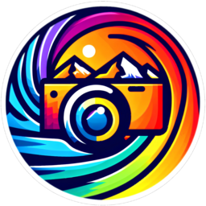

# Libre DT-Lab



**Libre DT-Lab** is an experimental fork of [darktable](https://www.darktable.org/), an open source photography workflow application and non-destructive RAW developer.

This fork serves as a development lab for exploring new approaches to the photographic workflow. It includes original modules and modifications to existing tools that are not yet part of the official darktable release.

---

## What's different from darktable

### New module, Contrast & Texture
A multi-scale contrast processing module for scene-referred linear RGB space, fully compatible with Rec.2020 wide-gamut workflows.

**Architecture:**
- Five interdependent frequency scales using Edge-aware Image Guided Filtering (EIGF)
- **Global contrast** via a Contrast Sensitivity Function (CSF) centered on middle gray (0.1845)
- **Pyramidal local contrast**, micro to extended, driven by a spatial blending parameter
- **Chromatic contrast**, colorimetric (red/blue channel difference) and colorful (warm/cool separation)
- Automatic resolution adaptation, normalized to 36 MP sensor as reference

Built upon the proof-of-concept algorithm proposed by WileCoyote:
https://discuss.pixls.us/t/experiments-with-a-scene-referred-local-contrast-module-proof-of-concept/55402

### Enhanced module, Basecurve (scene-referred workflow)
Extended basecurve with an adaptive ACES tone mapping shoulder based on JzAzBz perceptual luminance.

- **ACES 1.0** (Narkowicz 2016) and **ACES 2.0** (Narkowicz/Filiberto 2021) rational approximations
- Luminance-adaptive shoulder: `k = 1 + α × Jz²` avoids highlight crushing on already-bright areas
- UCS saturation balance, gamut compression, highlight hue/saturation correction
- Color look matrix (10 presets)

### Native sidecar format :`.lab.xmp`
Libre DT-Lab writes sidecars as `image.ext.lab.xmp` instead of `image.ext.xmp`.

This allows **safe coexistence** with darktable on the same image library:
- Libre DT-Lab reads and writes `.lab.xmp` (native)
- If no `.lab.xmp` exists, falls back to reading `.xmp` (darktable compatibility)
- darktable is never affected by Libre DT-Lab edits

### Separate configuration directory
Configuration and cache are stored in `~/.config/libre-dt-lab/` and `~/.cache/libre-dt-lab/`, completely separate from darktable.

---

## Download

Pre-built packages are available in the [Releases](https://github.com/Christian-Bouhon/libre-dt-lab/releases/tag/nightly) section.

### Linux AppImage
```bash
chmod +x libre-dt-lab-*-x86_64.AppImage
./libre-dt-lab-*-x86_64.AppImage
```

---

## Build from source

### Dependencies (Ubuntu/Debian)
```bash
sudo apt install build-essential cmake ninja-build \
    libgtk-3-dev liblcms2-dev liblensfun-dev \
    libsqlite3-dev libcurl4-gnutls-dev libpng-dev \
    libtiff5-dev libexiv2-dev libpugixml-dev \
    libgphoto2-dev libgmic-dev intltool
```

### Compile
```bash
git clone https://github.com/Christian-Bouhon/libre-dt-lab.git
cd libre-dt-lab
git submodule init
git submodule update
cmake -S . -B build -G Ninja -DCMAKE_BUILD_TYPE=Release
cmake --build build -- -j$(nproc)
./build/bin/darktable
```

---

### Relationship with darktable

Libre DT-Lab is a friendly laboratory built on top of darktable, not a competitor.
Think of it as a workbench where new ideas can be tested and refined freely, without the constraints of a large open source project. All original copyright headers are preserved, and new code is contributed under the same GPLv3 license.
My recent developments are available here for anyone who wishes to use them, study them, or draw inspiration from them.
Feedback and contributions are very welcome, this is a lab, not a cathedral. 🔬


---

## ⚠️ Important notes

- This is **experimental software**, use with caution
- Database schema may differ from official darktable, **use a separate library**
- The `.lab.xmp` sidecar format is specific to Libre DT-Lab

---

## License

GNU General Public License v3.0, see [LICENSE](LICENSE) for details.

---

## Credits

- [darktable project](https://www.darktable.org/) and all its contributors
- [WileCoyote, original local contrast proof-of-concept](https://discuss.pixls.us/t/experiments-with-a-scene-referred-local-contrast-module-proof-of-concept/55402)
- Christian Bouhon, Libre DT-Lab fork, Contrast & Texture module, basecurve enhancements

*Greetings from Luberon, Provence* 🌿