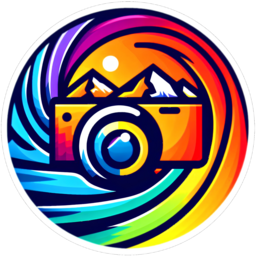

# Libre DT-Lab



**Libre DT-Lab** is an experimental fork of [darktable](https://www.darktable.org/), an open source photography workflow application and non-destructive RAW developer.

This fork serves as a development lab for exploring new approaches to the photographic workflow. It includes original modules and modifications to existing tools that are not yet part of the official darktable release.

---

## What's different from darktable

### New module, Contrast & Texture
A multi-scale contrast processing module for scene-referred linear RGB space, fully compatible with Rec.2020 wide-gamut workflows.

**Architecture:**
- Five interdependent frequency scales using Edge-aware Image Guided Filtering (EIGF)
- **Global contrast** via a Contrast Sensitivity Function (CSF) centered on middle gray (0.1845)
- **Pyramidal local contrast**, micro to extended, driven by a spatial blending parameter
- **Chromatic contrast**, colorimetric (red/blue channel difference) and colorful (warm/cool separation)
- Automatic resolution adaptation, normalized to 36 MP sensor as reference

Built upon the proof-of-concept algorithm proposed by WileCoyote:
https://discuss.pixls.us/t/experiments-with-a-scene-referred-local-contrast-module-proof-of-concept/55402

### Enhanced module, Basecurve (scene-referred workflow)
Extended basecurve with an adaptive tone-mapping engine layered on top of the
reference curve, selectable through four workflows:

- **display** — the classic display-referred curve
- **kinematic** — ACES 1.0 curve (Narkowicz 2016) with a luminance-adaptive
  shoulder `k = 1 + α × Jz²` (JzAzBz) that protects already-bright areas from
  highlight crushing
- **dynamic** — ACES RRT/ODT approximation (BakingLab RRTAndODTFit) with the same
  adaptive JzAzBz shoulder
- **cinematic DRT** — an OpenDRT-inspired colour appearance pipeline in Oklab:
  UCS saturation balance, gamut-safe chroma compression, vector-norm/purity
  grading (contrast-brilliance, highlight gain, shadow lift) and highlight
  hue/saturation correction

Additional tools:

- Lightness-independent gamut compression with separate cyan/magenta/yellow
  thresholds and limits
- Color look matrix (11 presets) with look opacity
- Luminance reference selectable between sRGB/Rec.709, AdobeRGB and Rec. 2020
- Highlight roll-off control

### New module, 3DCF (3D Colorimetric Film)
A global tone mapping module built on the official **ACES 2.0 SSTS** (Single-Stage
Tone Scale), the "texture of light" of the ACES 2.0 reference rendering, combined
with a spectral-gamut film simulation.

- **ACES 2.0 SSTS**, Michaelis-Menten parametric curve with flare compensation
- Spectral film gamut handling in CIE xy chromaticity space (Spektrafilm-inspired),
  preserving perceived hue while smoothly compressing out-of-gamut colors
- Full parameter set: contrast, contrast pivot, gamma, toe/shoulder power, vibrance,
  chromatic boost, peak luminance, input exposure, Abney rotation (hue roll-off),
  highlight desaturation with threshold, gamut knee/steepness, detail recovery
- Display targets: sRGB, Rec. 2020, Display P3, ProPhoto RGB, Adobe RGB
- 11 color looks (neutral to authentic cinema), with look opacity
- CPU and OpenCL GPU implementations

### New module, ACES 2.0 Reference Rendering
The ACES 2.0 CAM DRT (colour appearance model display rendering transform),
faithful to the official ACES 2.0 reference output transform (April 2025).

- Working-space agnostic: converts from/to the pipe's profile internally via ACES AP1 (D60)
- CAT16-based JMh pipeline: `pipe RGB → AP1 → XYZ → ×100 nits → CAT16 JMh`
- Tone mapping in JMh (display-J tonescale) + chroma compression, then double gamut
  compression (JMh and AP1)
- AP0/AP1 matrices per SMPTE ST 2065-1

### Tone-mapping (TM) selector
A tone-mapping workflow selector in the bottom toolchain modulegroups that swaps
the active tone mapper with one click, while keeping all other modules untouched:

- none · filmic · sigmoid · AgX · basecurve · 3DCF · ACES 2.0

Selecting an entry automatically disables the other tone mappers, loads and enables
the chosen one, expands it and switches to its module group. The selector is
synchronized with the quick-access preset panel and stored in the workflow
setting.

### Detachable modules
Module headers can show a **detach button** (enable via *preferences → darkroom →
modules → "show detach button in module headers"*), which moves the entire module
panel into a separate window.

- The detached window keeps the module's enable/disable toggle in its header
- The module keeps a placeholder in the panel; clicking detach again re-attaches it
- Uses the same settings and history as the in-place module

### Native sidecar format :`.lab.xmp`
Libre DT-Lab writes sidecars as `image.ext.lab.xmp` instead of `image.ext.xmp`.

This allows **safe coexistence** with darktable on the same image library:
- Libre DT-Lab reads and writes `.lab.xmp` (native)
- If no `.lab.xmp` exists, falls back to reading `.xmp` (darktable compatibility)
- darktable is never affected by Libre DT-Lab edits

### Separate configuration directory
Configuration and cache are stored in `~/.config/libre-dt-lab/` and `~/.cache/libre-dt-lab/`, completely separate from darktable.

---

## Download

Pre-built packages are available in the [Releases](https://github.com/Christian-Bouhon/libre-dt-lab/releases/tag/Main) section.

### Linux AppImage
```bash
chmod +x libre-dt-lab-*-x86_64.AppImage
./libre-dt-lab-*-x86_64.AppImage
```

---

## Build from source

### Dependencies (Ubuntu/Debian)
```bash
sudo apt install build-essential cmake ninja-build \
    libgtk-3-dev liblcms2-dev liblensfun-dev \
    libsqlite3-dev libcurl4-gnutls-dev libpng-dev \
    libtiff5-dev libexiv2-dev libpugixml-dev \
    libgphoto2-dev libgmic-dev intltool
```

### Compile
```bash
git clone https://github.com/Christian-Bouhon/libre-dt-lab.git
cd libre-dt-lab
git submodule init
git submodule update
cmake -S . -B build -G Ninja -DCMAKE_BUILD_TYPE=Release
cmake --build build -- -j$(nproc)
./build/bin/darktable
```

---

### Relationship with darktable

Libre DT-Lab is a friendly laboratory built on top of darktable, not a competitor.
Think of it as a workbench where new ideas can be tested and refined freely, without the constraints of a large open source project. All original copyright headers are preserved, and new code is contributed under the same GPLv3 license.
My recent developments are available here for anyone who wishes to use them, study them, or draw inspiration from them.
Feedback and contributions are very welcome, this is a lab, not a cathedral. 🔬


---

## ⚠️ Important notes

- This is **experimental software**, use with caution
- Database schema may differ from official darktable, **use a separate library**
- The `.lab.xmp` sidecar format is specific to Libre DT-Lab

---

## License

GNU General Public License v3.0, see [LICENSE](LICENSE) for details.

---

## Credits

- [darktable project](https://www.darktable.org/) and all its contributors
- [WileCoyote, original local contrast proof-of-concept](https://discuss.pixls.us/t/experiments-with-a-scene-referred-local-contrast-module-proof-of-concept/55402)
- Christian Bouhon, Libre DT-Lab fork, Contrast & Texture module, basecurve enhancements

*Greetings from Luberon, Provence* 🌿